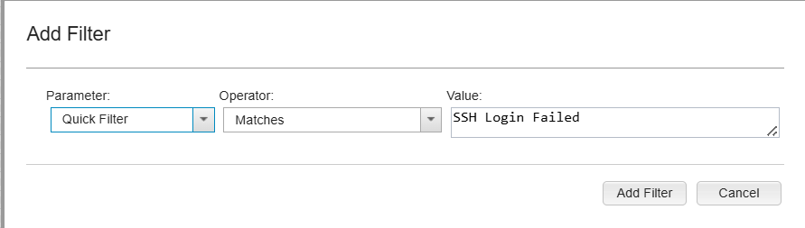
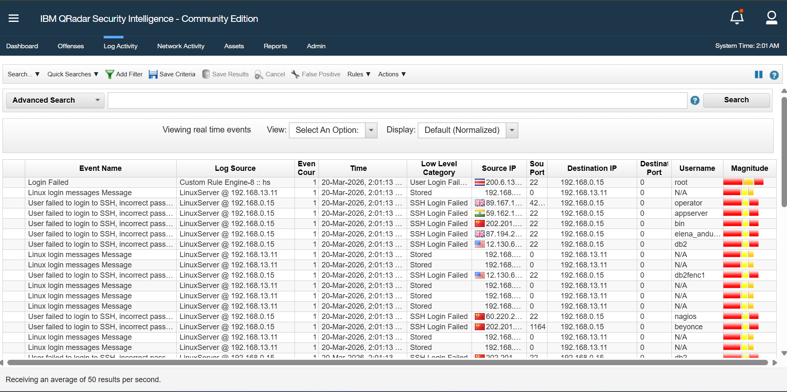
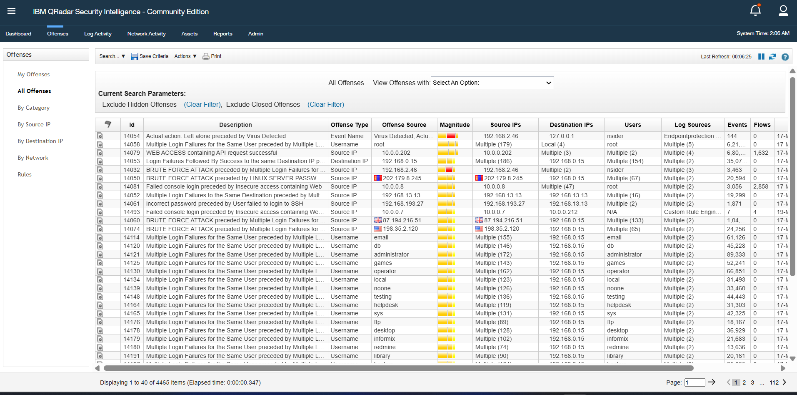

# Brute Force Attack Investigation

---

## Description
In this lab, IBM QRadar SIEM was used to investigate a brute force attack targeting a Linux server.  
The analysis focuses on identifying failed login patterns, correlating events into offenses, and validating the alert as a true positive.

---

## Lab Environment

- **SIEM:** IBM QRadar Community Edition  
- **Log Source:** Linux Server  
- **Attack Type:** SSH Brute Force  

---

## Investigation Workflow

### Step 1: Log Analysis
Applied filter to identify failed SSH login attempts:

---

### Step 2: Event Investigation
Analyzed logs to identify suspicious activity patterns:

---

### Key Observations

- Multiple failed login attempts  
- Same destination IP: **192.168.0.15**  
- Multiple usernames targeted  
- High frequency of attempts  

---

### Step 3: Offense Correlation
QRadar correlated events into a security offense:

---

## Offense Details

- **Rule:** Brute Force Attack  
- Multiple login failures detected  
- High magnitude score  
- Thousands of events generated  

---

## Detection Logic

The attack was identified based on:

- Repeated failed login attempts  
- Multiple usernames targeted  
- Same destination host  
- High event volume in a short time  

---

## MITRE ATT&CK

- **T1110 — Brute Force**

---

## Why This is Malicious

- Normal users do not generate multiple failed login attempts in seconds  
- Multiple usernames suggest password guessing attempts  
- External IP addresses indicate unauthorized access attempts  
- High event volume confirms automated attack tools  

Therefore, this activity is classified as a **True Positive Brute Force Attack**.

---

## Incident Report

### Time of Activity
- 20 March 2026 (~02:00 AM – 02:06 AM)

---

### Affected Entities
- **Host:** 192.168.0.15  

---

### Users Targeted
- root  
- admin  
- db  
- operator  

---

### Source IPs
- Multiple external IPs  

---

### Reason for True Positive

- High volume of failed login attempts  
- Multiple usernames targeted  
- QRadar offense triggered  
- Matches brute force attack behavior  

---

### Reason for Escalation

- Critical service targeted (**SSH**)  
- Risk of unauthorized access  
- Persistent attack pattern  

---

### Recommended Actions

- Block attacker IPs  
- Disable root SSH login  
- Enable Multi-Factor Authentication (MFA)  

---

### Indicators of Compromise (IOCs)

- Multiple failed SSH logins  
- External IP addresses  
- High event count  
- Target port: **22 (SSH)**  

---

## Analyst Findings

During the investigation, the following suspicious behavior was identified:

- Multiple failed SSH login attempts from external IP addresses  
- Same destination host (`192.168.0.15`) targeted repeatedly  
- Multiple usernames such as `root`, `admin`, and `db` were targeted  
- High frequency of attempts within a short time window  

This pattern indicates an automated brute force attack attempting to gain unauthorized access.
