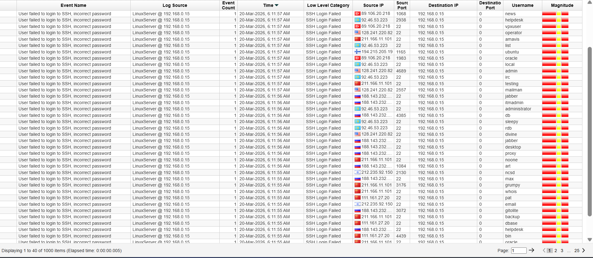

# Distributed Password Spraying Attack Investigation

## Description

In this lab, I used IBM QRadar SIEM to investigate a distributed password spraying attack targeting a Linux server.
The analysis focuses on identifying failed SSH login patterns, analyzing attacker behavior across multiple IP addresses, and validating the activity as a true positive attack.

## Lab Environment

SIEM: IBM QRadar Community Edition,
Log Source: Linux Server,
Attack Type: Distributed Password Spraying (SSH),

## Investigation Workflow
#### Step 1: Log Analysis

Applied filter to identify failed SSH login attempts:

##### Step 2: Event Investigation

Analyzed logs to identify suspicious activity patterns:

Key Observations: Multiple failed login attempts, Same destination IP: 192.168.0.15, Multiple usernames targeted (admin, oracle, ubuntu, etc.), Multiple external source IP addresses, High frequency of login attempts

### Offense Details:

Rule: SSH Authentication Failure / Brute Force Detection,
Multiple login failures detected,
High magnitude score,
Large volume of events generated in short time.

### Detection Logic

The attack was identified based on: Repeated failed login attempts, Multiple usernames targeted, Multiple source IP addresses, Same destination host, High event volume in a short time

## MITRE ATT&CK

T1110 — Brute Force (Password Spraying)

## Why This is Malicious

- Normal users do not attempt multiple logins across many usernames in seconds
- Multiple usernames indicate password spraying attempts rather than user error
- Multiple external IP addresses suggest distributed attack infrastructure
- High event volume confirms automated attack tools targeting SSH service
- Therefore, this activity is classified as a True Positive Distributed Password Spraying Attack.

## Incident Report

### Time of Activity
- 20 March 2026 (~06:15 AM – 06:17 AM)

---

### Affected Entities
- **Host:** 192.168.0.15

---

### Users Targeted
- admin  
- oracle  
- ubuntu  
- test  
- guest  
- postgres  

---

### Source IPs
- Multiple external IPs (geographically distributed)

---

### Reason for True Positive
- High volume of failed login attempts  
- Multiple usernames targeted  
- Multiple source IPs observed  
- Matches password spraying behavior  

---

### Reason for Escalation
- Critical service targeted (**SSH - Port 22**)  
- External attack sources  
- Risk of account compromise if successful  

---

### Recommended Actions
- Block malicious IP addresses at firewall  
- Disable password-based SSH authentication  
- Enable Multi-Factor Authentication (MFA)  
- Implement account lockout policies  
- Monitor for successful login attempts  

---

### Indicators of Compromise (IOCs)
- Multiple failed SSH login attempts  
- External IP addresses  
- High event count  
- Target port: **22 (SSH)**  
- Multiple usernames targeted  

---

## Analyst Findings

During the investigation, the following suspicious behavior was identified:

- Multiple failed SSH login attempts from various external IP addresses  
- A single destination host (`192.168.0.15`) was consistently targeted  
- Numerous usernames such as `admin`, `oracle`, and `ubuntu` were used  
- The attack pattern shows distributed login attempts across many usernames  

---

### Conclusion

This behavior clearly indicates a **distributed password spraying attack**, where attackers attempt commonly used credentials across multiple accounts to gain unauthorized access.
