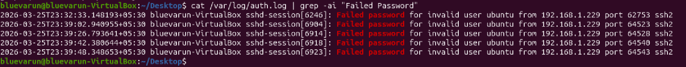
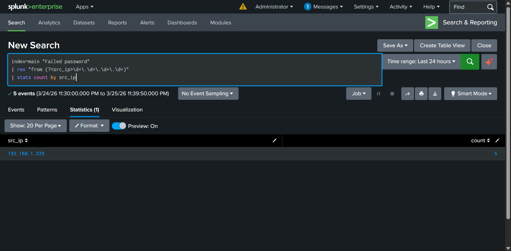

# SSH Brute Force Detection Lab

## 1. Objective
Simulate and detect a brute force attack against an SSH service using:
- Kali Linux (attacker)
- Ubuntu Server (victim)
- Splunk Enterprise (SIEM)

---

## 2. Lab Architecture

| Role      | System         | Purpose              |
|----------|---------------|---------------------|
| Attacker | Kali Linux    | Launch brute force  |
| Victim   | Ubuntu Server | Generate auth logs  |
| SIEM     | Splunk        | Detect attack       |

---

## 3. Attack Simulation

A brute force attack was performed using Hydra targeting SSH on the Ubuntu server.

### Command Used
hydra -l ubuntu -P /usr/share/wordlists/rockyou.txt ssh://192.168.1.229

## 4. Log Evidence (Ubuntu)

Authentication logs were analyzed from:
/var/log/auth.log

### Command Used for Filtering Logs
cat /var/log/auth.log | grep -ai "Failed password"

# Explanation of Flags
-a → Treats binary files as text
Useful when logs contain mixed or non-standard characters

-i → Case-insensitive search
### Ensures matching of:
Failed password
FAILED PASSWORD
failed password

## Evidence Screenshot:

## 5. SIEM Detection (Splunk)

### SPL Query Used
index=main "Failed password"
| rex "from (?<src_ip>\d+\.\d+\.\d+\.\d+)"
| stats count by src_ip

### Explanation
- index=main → Searches main index
- "Failed password" → Filters failed login events
- rex → Extracts source IP using regex
- stats count by src_ip → Counts attempts per attacker IP

### Detection Output Screenshot:

## 6. Findings

- Attacker IP	192.168.1.229
- Attempts	5
- Target	SSH (Port 22)
- Log Source	/var/log/auth.log

## 7. Analysis

- Multiple failed login attempts observed from a single IP
- Pattern matches automated brute force activity
- No successful login detected in this dataset
- Splunk required manual field extraction due to unstructured logs

## 8. Impact Assessment
- Potential credential compromise
- Unauthorized access risk
- Indicator of automated attack activity

## 9. Recommendations
- Implement account lockout policies
- Enforce strong password policies
- Use SSH key-based authentication
- Deploy Fail2Ban for IP blocking
- Configure SIEM alerts for threshold breaches

## 10. Alert Classification

### True Positive (TP)

**Time of Activity:**  
25 March 2026 (based on Splunk event timestamps)

**List of Affected Entities:**  
- Source IP: 192.168.1.229  
- Destination Host: Ubuntu Server  
- Service Targeted: SSH (Port 22)  
- Log Source: /var/log/auth.log  

**Reason for Classifying as True Positive:**  
- Multiple failed login attempts observed from a single IP address  
- Activity pattern matches automated brute force behavior  
- Logs confirm repeated authentication failures within a short timeframe  
- Attack originated externally (Kali attacker machine)

**Reason for Escalating the Alert:**  
- Threshold of failed login attempts reached (≥5 attempts)  
- Potential risk of credential compromise  
- Brute force attacks are a common initial access technique  

**Recommended Remediation Actions:**  
- Block attacker IP at firewall level  
- Enable account lockout policy  
- Enforce strong password policies  
- Implement SSH key-based authentication  
- Deploy Fail2Ban for automated blocking  
- Monitor authentication logs continuously  

**List of Attack Indicators (IOCs):**  
- Repeated "Failed password" entries in logs  
- Source IP: 192.168.1.229  
- SSH authentication attempts on port 22  
- High frequency of login failures  
