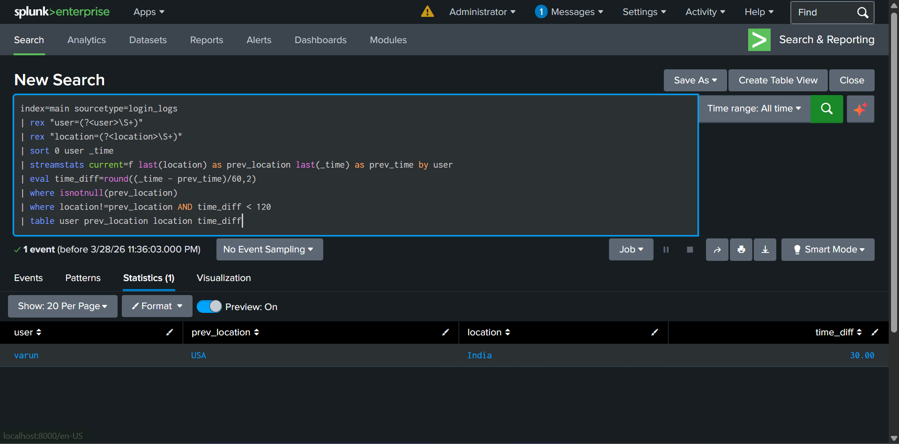

# Impossible Travel Detection 

## Overview

This project demonstrates detection of *Impossible Travel*, a common cloud security use case where a user logs in from geographically distant locations within a short time frame. Such behavior is typically indicative of credential compromise or unauthorized access.

The detection logic is implemented using Splunk SPL by correlating login events based on user identity, location, and timestamp.

---

## Objective

- Detect abnormal login behavior across different geolocations  
- Identify potential account compromise scenarios  
- Perform behavioral analysis using event correlation  
- Develop a practical SOC detection use case  

---

## Lab Environment

| Component        | Details                |
|-----------------|-----------------------|
| SIEM            | Splunk Enterprise     |
| Data Source     | Simulated login logs  |
| Detection Type  | Behavioral Detection  |
| Technique       | Event Correlation     |

---

## Attack Simulation

The following login activity was simulated:


2026-03-28T10:00:00 user=varun ip=8.8.8.8 location=USA
2026-03-28T10:30:00 user=varun ip=1.1.1.1 location=India
2026-03-28T11:00:00 user=alex ip=5.5.5.5 location=UK
2026-03-28T18:00:00 user=alex ip=5.5.5.5 location=UK


The user `varun` appears to log in from the USA and India within 30 minutes, which is not physically possible and indicates suspicious activity.

---

## Data Ingestion

The log file was ingested into Splunk with the following configuration:

- Index: `main`  
- Sourcetype: `login_logs`  

---

## Detection Logic (SPL)

```spl
index=main sourcetype=login_logs
| rex "user=(?<user>\S+)"
| rex "location=(?<location>\S+)"
| sort 0 user _time
| streamstats current=f last(location) as prev_location last(_time) as prev_time by user
| eval time_diff=round((_time - prev_time)/60,2)
| where isnotnull(prev_location)
| where location!=prev_location AND time_diff < 120
| table user prev_location location time_diff
Detection Output

Add your screenshot here:

Incident Analysis
Field	Value
User	varun
Previous Location	USA
Current Location	India
Time Difference	30 min
True Positive Analysis

Time of Activity:
2026-03-28

Affected Entity:
User account: varun

Reason for Classification:

Login from geographically distant locations
Unrealistic travel time between locations
Strong indicator of credential compromise

Reason for Escalation:

Potential account takeover
Unauthorized access to systems

Recommended Actions:

Force password reset
Enable multi-factor authentication (MFA)
Review login activity and session history
Block or monitor suspicious IP addresses
False Positive Scenarios
VPN usage causing location changes
Corporate proxy infrastructure
Mobile network switching between regions
Challenges and Resolution
Initial detection failed due to incorrect field extraction using regex
Event correlation did not work due to improper sorting
Issues were resolved by:
Using \S+ for accurate field extraction
Sorting events before applying streamstats
Key Learnings
Behavioral detection is more effective than signature-based approaches
Event sequencing is critical for correlation-based detections
Splunk streamstats enables powerful temporal analysis
Impossible travel detection is widely used in cloud security monitoring
MITRE ATT&CK Mapping
Technique	ID
Valid Accounts	T1078
