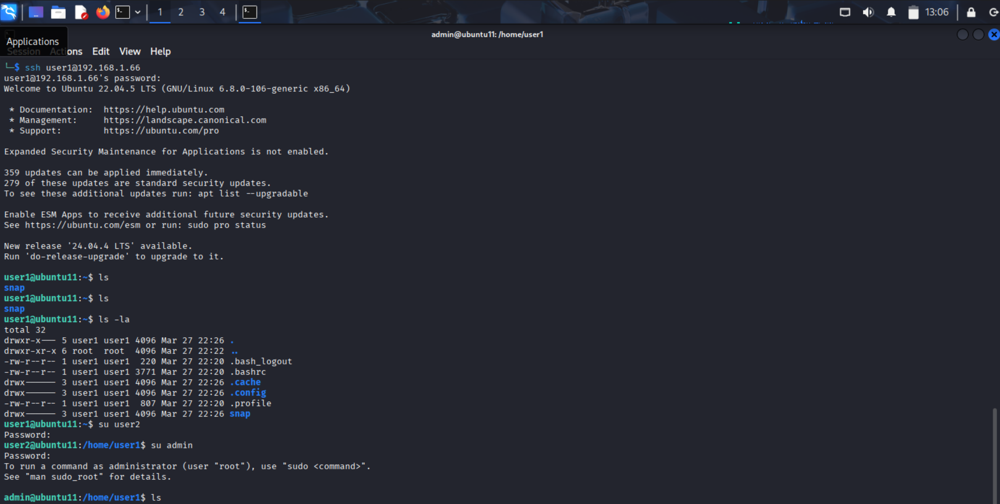
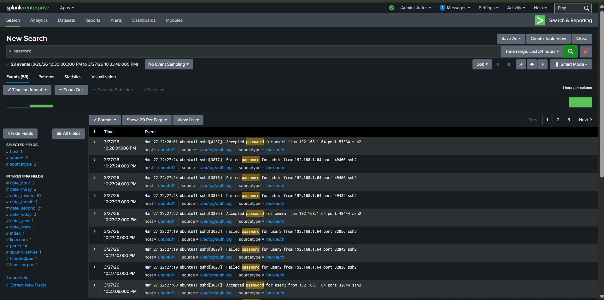
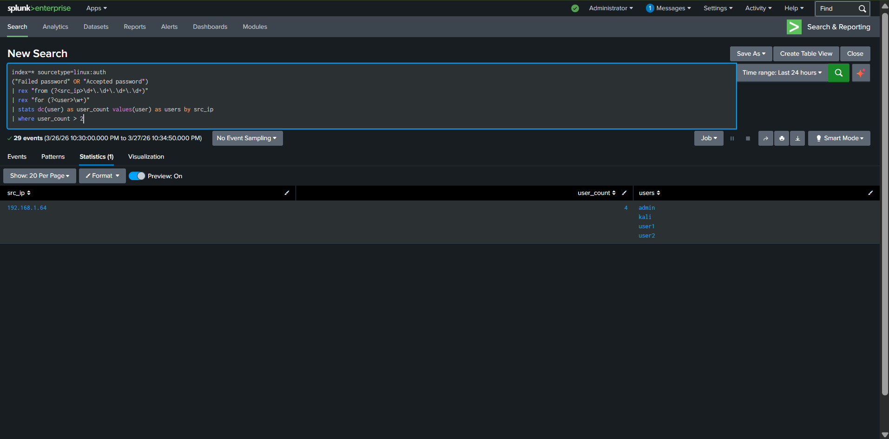
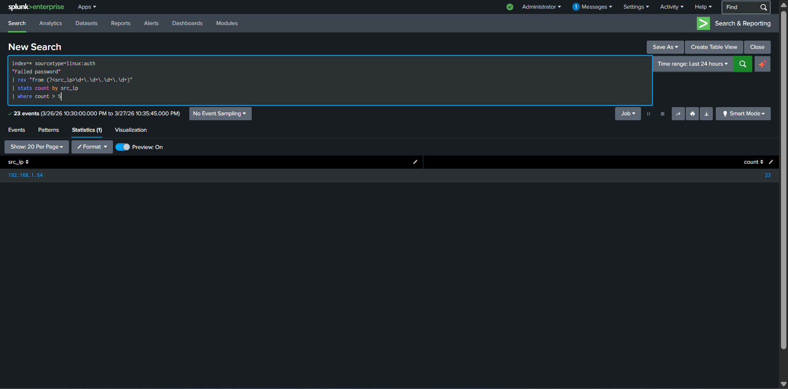

# Lateral Movement Detection

## Objective

This lab simulates and detects lateral movement behavior where a single attacker system attempts authentication across multiple user accounts on a Linux machine.

**Goals:**
- Detection engineering in Splunk Enterprise
- Real-world attacker behavior (credential abuse + pivoting)  
- SOC L2 level investigation & analysis

---

## Lab Environment

| Component    | Description                  |
|--------------|------------------------------|
| **Attacker** | Kali Linux                   |
| **Victim**   | Ubuntu 22.04                 |
| **SIEM**     | Splunk Enterprise (Windows 11) |
| **Log Source**| `/var/log/auth.log`         |

---

## Attack Simulation

### Step 1 — SSH Login (Initial Access)

Attacker logs into victim:
```bash
ssh user1@192.168.1.66
```

**Screenshot 1 — Initial Access + Privilege Pivot**  


SSH login successful. Attacker switches users:
```bash
su user2
su admin
```

### Step 2 — Brute Force Attempts

Using Hydra, attacker attempts multiple logins:
- user1
- user2  
- admin

**Generates:**
- Failed logins
- Successful logins
- Multiple authentication patterns

**Screenshot 2 — Raw Logs in Splunk**  


**Shows:**
- Failed password attempts
- Accepted logins
- Same IP interacting with multiple users

---

## Detection Engineering (Splunk Queries)

### Detection 1 — Lateral Movement (Core Detection)

```spl
index=* sourcetype=linux:auth
("Failed password" OR "Accepted password")
| rex "from (?<src_ip>\d+\.\d+\.\d+\.\d+)"
| rex "for (?<user>\w+)"
| stats dc(user) as user_count values(user) as users by src_ip
| where user_count > 2
```

**Screenshot 3 — Detection Output**  


**Explanation**

| Part              | Meaning                      |
|-------------------|------------------------------|
| `rex`             | Extract IP & username        |
| `stats dc(user)`  | Count unique users           |
| `values(user)`    | Show all users accessed      |
| `where user_count > 2` | Detect suspicious activity |

**Why This Works:**  
Detects same source IP accessing multiple user accounts — strong indicator of credential abuse, lateral movement, and post-compromise activity.

### Detection 2 — Attack Timeline Reconstruction

```spl
index=* sourcetype=linux:auth
("Failed password" OR "Accepted password")
| rex "from (?<src_ip>\d+\.\d+\.\d+\.\d+)"
| rex "for (?<user>\w+)"
| table _time src_ip user _raw
| sort _time
```

**Screenshot 4 — Timeline View**  


**Explanation:**  
Helps SOC analysts track attack progression, identify brute force → success → pivot patterns, and understand attacker behavior step-by-step.

### Detection 3 — Brute Force Activity

```spl
index=* sourcetype=linux:auth
"Failed password"
| rex "from (?<src_ip>\d+\.\d+\.\d+\.\d+)"
| stats count by src_ip
| where count > 5
```

**Explanation**

| Part              | Meaning                      |
|-------------------|------------------------------|
| `Failed password` | Detect failed attempts       |
| `stats count`     | Count attempts per IP        |
| `where count > 5` | Threshold detection          |

Identifies brute-force attacks from attacker IP.

---

## Report

**Key Findings:**
- Single IP: `192.168.1.64`
- Accessed multiple users: `user1`, `user2`, `admin`, `kali`
- Observed: Multiple failed logins, successful logins, account switching using `su`

**Conclusion:**  
**Lateral Movement via Credential Abuse**  
**Classification: TRUE POSITIVE**

**Time of Activity:** 

**Affected Entities:**
| Entity     | Value              |
|------------|--------------------|
| **Host**   | Ubuntu Server      |
| **Users**  | user1, user2, admin|
| **Source IP**| 192.168.1.64     |

**Reason for Escalation:**
- Unauthorized access across multiple accounts
- Potential privilege escalation  
- High risk of further system compromise

---

## Recommended Mitigation

- Disable password-based SSH login
- Enforce SSH key authentication
- Implement account lockout policies
- Monitor abnormal login patterns
- Restrict `su` usage

---

## Indicators of Compromise (IOCs)

- Multiple failed SSH login attempts
- Same IP accessing multiple accounts
- Successful logins after failures
- Account switching activity (`su`)

---

## MITRE ATT&CK Mapping

| Technique              | ID    |
|------------------------|-------|
| Valid Accounts         | T1078 |
| Remote Services (SSH)  | T1021 |
| Brute Force            | T1110 |
| Privilege Escalation   | T1068 |
