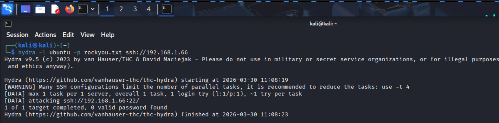
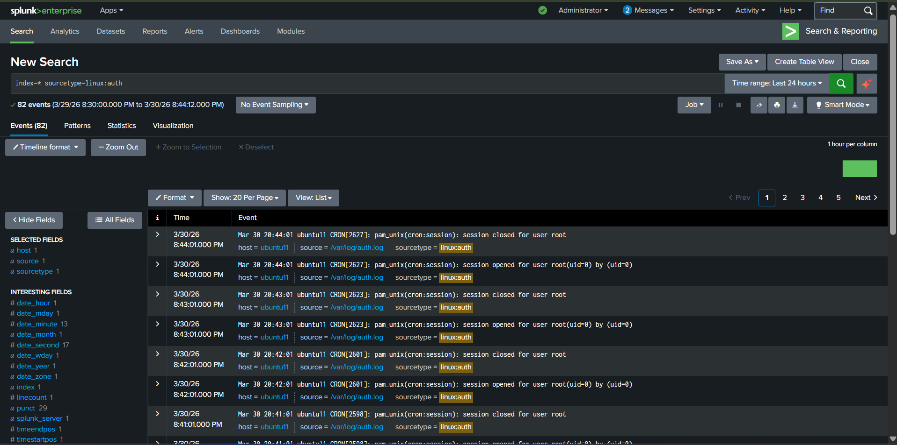
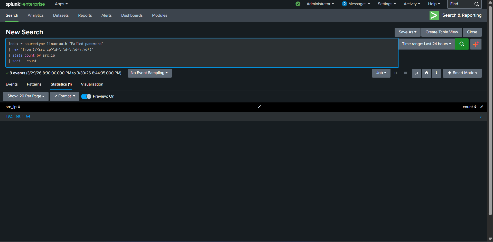
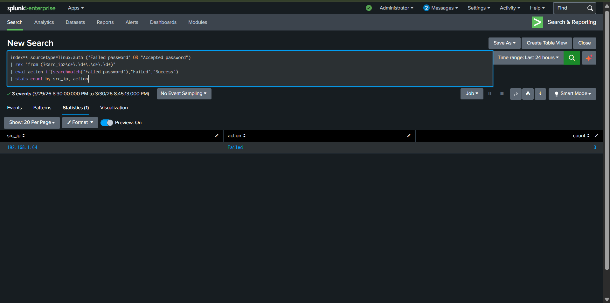
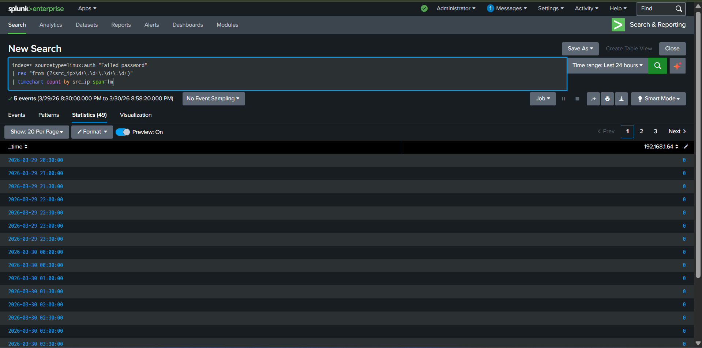
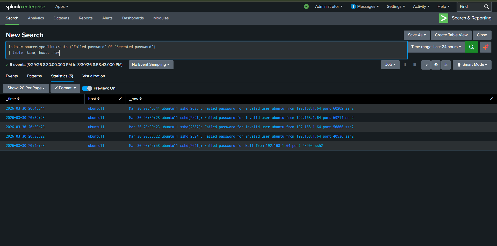
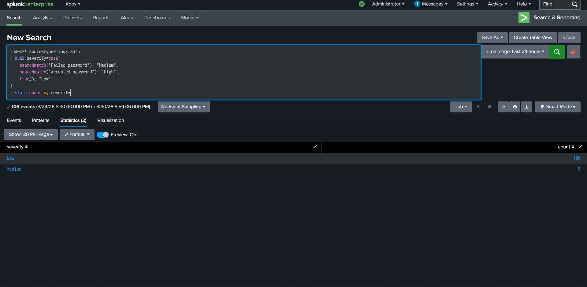

# Linux Authentication Threat Detection & Investigation

---

## Overview

This project demonstrates the detection and analysis of an SSH brute force attack using Splunk Enterprise in a controlled home lab environment.

The attack was simulated using Hydra from an attacker machine, while logs were collected from a Linux victim system and analyzed in Splunk.

---

## Lab Architecture

| Component    | Role                          |
|--------------|-------------------------------|
| Windows 11   | Splunk Enterprise (SIEM)      |
| Ubuntu       | Victim (SSH Server)           |
| Kali Linux   | Attacker (Hydra Tool)         |

---

## Attack Simulation

```bash
hydra -l ubuntu -p rockyou.txt ssh://192.168.1.66
```



**Observations:**

- Multiple failed login attempts generated
- Targeted user: `ubuntu`
- Attacker IP: `192.168.1.64`
- No valid password found

---

## Log Ingestion Verification

```spl
index=* sourcetype=linux:auth
```



**Explanation:**

- Confirms logs are successfully ingested
- Filters Linux authentication logs
- Base query for all detections

---

## Failed Login Detection

```spl
index=* sourcetype=linux:auth "Failed password"
| rex "from (?<src_ip>\d+\.\d+\.\d+\.\d+)"
| stats count by src_ip
| sort - count
```



**Explanation:**

- Detects failed SSH logins
- Extracts attacker IP using regex
- Aggregates attempts per IP
- Identifies top attacker

**Finding:**

| Field       | Value         |
|-------------|---------------|
| Attacker IP | 192.168.1.64  |
| Attempts    | 3             |

---

## Severity Classification

```spl
index=* sourcetype=linux:auth
| eval severity=case(
    searchmatch("Failed password"), "Medium",
    searchmatch("Accepted password"), "High",
    true(), "Low"
)
| stats count by severity
```

>
**Explanation:**

- Assigns severity based on log type
- Helps SOC prioritize alerts

---

## Raw Log Evidence

```spl
index=* sourcetype=linux:auth ("Failed password" OR "Accepted password")
| table _time, host, _raw
```



**Explanation:**

- Shows original logs for investigation
- Useful for incident validation

---

## Time-Based Attack Analysis

```spl
index=* sourcetype=linux:auth "Failed password"
| rex "from (?<src_ip>\d+\.\d+\.\d+\.\d+)"
| timechart count by src_ip span=1m
```



**Explanation:**

- Visualizes attack pattern over time
- Detects burst activity (automation indicator)

---

## Attack Correlation

```spl
index=* sourcetype=linux:auth ("Failed password" OR "Accepted password")
| rex "from (?<src_ip>\d+\.\d+\.\d+\.\d+)"
| eval action=if(searchmatch("Failed password"),"Failed","Success")
| stats count by src_ip, action
```



**Explanation:**

- Correlates failed and successful attempts
- Helps detect account compromise

**Finding:**

- Only failed attempts observed
- No successful login

---

## SOC Analysis

| Attribute       | Value           |
|-----------------|-----------------|
| Attack Type     | SSH Brute Force |
| MITRE Technique | T1110           |
| Source IP       | 192.168.1.64    |
| Target System   | Ubuntu          |
| Outcome         | No compromise   |

---

## Alert Classification

- **Type:** True Positive
- **Severity:** Medium
- **Reason:** Repeated failed authentication attempts

---

## Recommendations

- Enable account lockout policy
- Use SSH key-based authentication
- Disable password login
- Implement MFA
- Restrict SSH access

---

## MITRE ATT&CK Mapping
 
| Technique                        | ID        | Description                                               |
|----------------------------------|-----------|-----------------------------------------------------------|
| Brute Force                      | T1110     | Repeated login attempts to guess valid credentials        |
| Brute Force: Password Spraying   | T1110.003 | Trying common passwords across multiple accounts          |
| Valid Accounts                   | T1078     | Using compromised credentials for access                  |
| Remote Services: SSH             | T1021.004 | Exploiting SSH for remote access                          |
 
---
