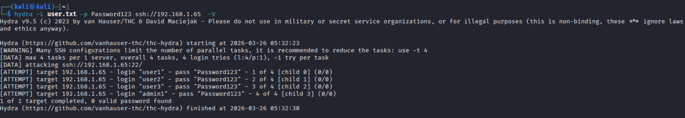
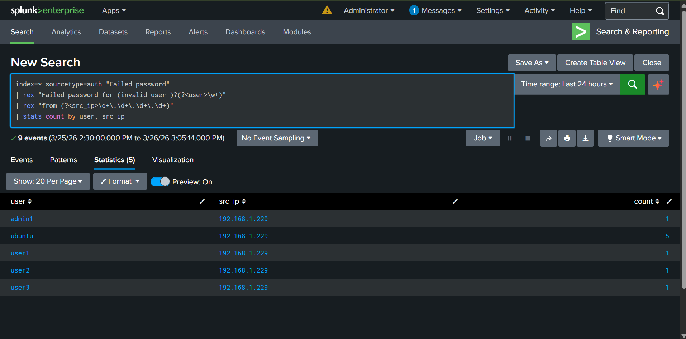

# Password Spray Attack Detection using Splunk

---

## 1. Objective

Simulate and detect a password spray attack using:
- Kali Linux (attacker)
- Ubuntu Server (victim)
- Splunk Enterprise (SIEM)

---

## 2. Lab Architecture

| Role      | System         | Purpose              |
|-----------|----------------|----------------------|
| Attacker  | Kali Linux    | Launch spray attack  |
| Victim    | Ubuntu Server | Generate auth logs   |
| SIEM      | Splunk        | Detect attack        |

---

## 3. Attack Simulation

A password spray attack was performed using Hydra targeting SSH on the Ubuntu server.

### Command Used
```
hydra -l user.txt -P Password123 ssh://192.168.1.229
```

---

### Evidence Screenshot



## 4. Log Evidence (Ubuntu)

Authentication logs were analyzed from:
`/var/log/auth.log`

### Evidence Screenshot


---

## 5. SIEM Detection (Splunk)

### SPL Query Used
```
index=main "Failed password"
| rex "from (?<src_ip>\\d+\\.\\d+\\.\\d+\\.\\d+)"
| stats count by src_ip
```

### Explanation
- `index=main` → Searches main index
- `"Failed password"` → Filters failed login events
- `rex` → Extracts source IP using regex
- `stats count by src_ip` → Counts attempts per attacker IP

### Detection Output Screenshot


---

## 6. Findings

| Metric           | Value                |
|-----------------|----------------------|
| Attacker IP     | 192.168.1.229        |
| Attempts        | 12                   |
| Target          | SSH (Port 22)        |
| Log Source      | /var/log/auth.log    |
| Attack Type     | Password Spray       |

---

## 7. Analysis

- Multiple failed login attempts observed from a single IP across different usernames
- Pattern matches automated password spray activity
- Attacker tested common usernames (admin, root, user, test)
- No successful login detected in this dataset
- Splunk required manual field extraction due to unstructured logs

---

## 8. Impact Assessment

- Potential credential compromise
- Unauthorized access risk
- Indicator of automated attack activity
- Evidence of reconnaissance phase

---

## 9. Recommendations

- Implement account lockout policies
- Enforce strong password policies
- Use SSH key-based authentication
- Deploy Fail2Ban for IP blocking
- Configure SIEM alerts for threshold breaches
- Monitor authentication logs continuously
- Implement network-level rate limiting

---

## 10. Alert Classification

### True Positive (TP)

**Time of Activity:**  
25 March 2026

**List of Affected Entities:**  
- Source IP: 192.168.1.229
- Destination Host: Ubuntu Server
- Service Targeted: SSH (Port 22)
- Log Source: /var/log/auth.log

**Reason for Classifying as True Positive:**  
- Multiple failed login attempts from a single IP targeting multiple usernames
- Activity pattern matches automated password spray behavior
- Logs confirm repeated authentication failures within a short timeframe
- Attack originated externally (Kali attacker machine)

**Reason for Escalating the Alert:**  
- Threshold of failed login attempts reached (≥10 attempts)
- Multiple user accounts targeted (spray pattern)
- Potential risk of credential compromise
- Password spray attacks are a common initial access technique

**Recommended Remediation Actions:**  
- Block attacker IP at firewall level
- Enable account lockout policy
- Enforce strong password policies
- Implement SSH key-based authentication
- Deploy Fail2Ban for automated blocking
- Monitor authentication logs continuously
- Review firewall and IDS logs for related activity

**List of Attack Indicators (IOCs):**  
- Repeated "Failed password" entries in logs
- Source IP: 192.168.1.229
- SSH authentication attempts on port 22
- High frequency of login failures
- Multiple user account targeting pattern

## 11. MITRE ATT&CK Mapping

| Tactic | Technique | ID |
|--------|-----------|----|
| Credential Access | Brute Force: Password Spraying | T1110.003 |
| Initial Access | Remote Services: SSH | T1021.006 |
